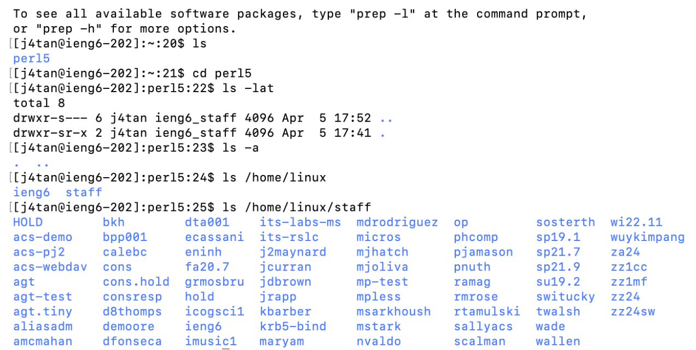

# First Lab Report - Jun T.
## 1. Installing VScode
1. Install *Visual Studio Code* from the website [https://code.visualstudio.com/](https://code.visualstudio.com/). 
2. Follow the instructions to download and install it. I downloaded the macOS version because my computer is Mac.
3. After successfully installing, I opened a window that lookd like this (you'll see something very similar to this picture after successfully installing, colors might be different).


## 2. Remotely Connecting
1. Reset password following this tutorial: [[TUTORIAL] How to Reset your CSE 15L Password](https://drive.google.com/file/d/17IDZn8Qq7Q0RkYMxdiIR0o6HJ3B5YqSW/view). Might need to wait a few minutes before the new password to take effect.
2. Install [Git for Windows](https://gitforwindows.org/) and follow steps in: [Using Bash on Windows in VScode](https://stackoverflow.com/a/50527994) if you have Windows. I have Mac so I skip this step.
3. Open a terminal in VScode and type *ssh course-specific account or tritonlink username* and then enter tritonlink password. I had problems when logging in using the course specific account. It might be due to missing home directory, but I successfully logged in using my   tritonlink username.
```
$ ssh j4tan@ieng6.ucsd.edu
```
4. This is the first time that I connected to this server, so I got a message asking if I want to continue. I typed yes and pressed enter, then gave my password. The message is like this:
```
⤇ ssh cs15lsp23zz@ieng6.ucsd.edu
The authenticity of host 'ieng6.ucsd.edu (128.54.70.227)' can't be established.
RSA key fingerprint is SHA256:ksruYwhnYH+sySHnHAtLUHngrPEyZTDl/1x99wUQcec.
Are you sure you want to continue connecting (yes/no/[fingerprint])? 
```
5. After successfully connecting to the remote server, I saw something like this:


## 3. Trying Some Commands
1. Type *ls* to see all the names and folders directly in the directory. 
2. Use *cd perl5* to switch to the path *perl5*. 
3. Type *ls -lat* to see all the mode, number of links, owner, group, size (in bytes), and time of last modification for each file. 
4. Type *ls -a* to look for all possible directory that I can access in *perl5*
5. Given directory /home/linux/ieng6/cs15lsp23/..., type *ls /home/linux* and *ls /home/linux/staff* to see the files and folders in the given path.

**This is a screenshot of the commands listed above:**

